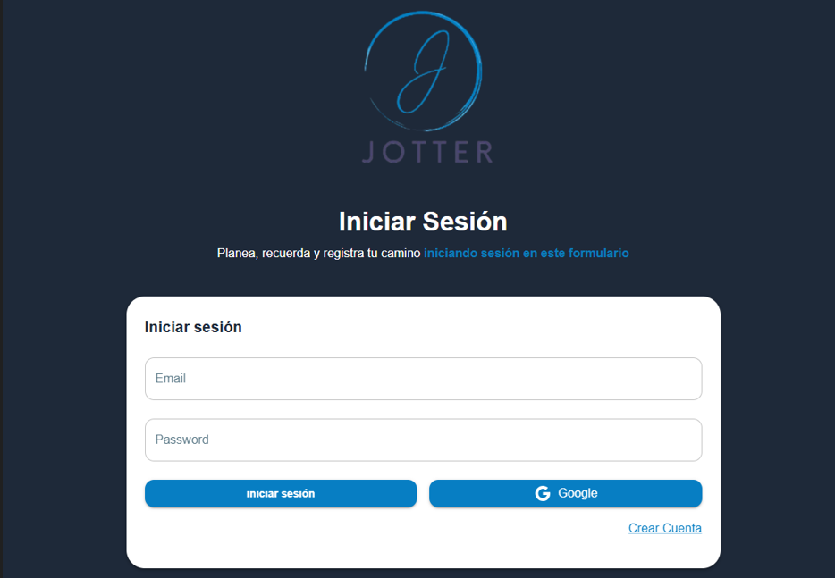
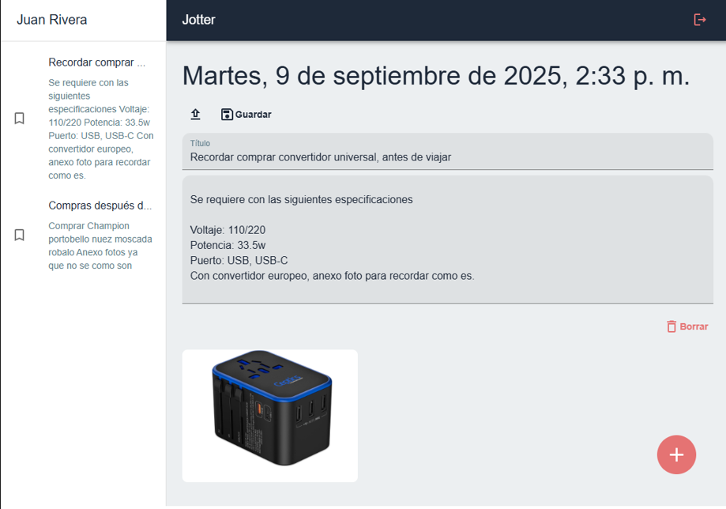

# 📝 Jotter Journal - Aplicación de Recordatorios y Notas

Jotter Journal es una aplicación web que permite a los usuarios **crear recordatorios y notas con asuntos, subir imágenes y organizar sus registros** de manera sencilla.  
Los usuarios y sus registros se gestionan con **Firebase**, y las imágenes se almacenan en **Cloudinary**.

🔗 **Demo en vivo**: [https://jotter-journal.vercel.app/](https://jotter-journal.vercel.app/)  
🌐 **Portafolio**: [https://portfolio-drab-six-76.vercel.app/](https://portfolio-drab-six-76.vercel.app/)

---

## ✨ Características principales

- 📝 Crear y gestionar recordatorios y notas con título y descripción.  
- 📸 Subida de imágenes que se almacenan en **Cloudinary**.  
- 🔒 Gestión de usuarios y autenticación con **Firebase**.  
- ⚡ Interfaz moderna y responsiva con **Material UI** y **Emotion**.  
- 🔄 Navegación fluida entre páginas con **React Router DOM**.  
- ✅ Alertas y confirmaciones interactivas con **SweetAlert2**.  
- 📦 Manejo del estado global con **Redux Toolkit**.  

---

## 🛠️ Tecnologías utilizadas

- **React 18** + **TypeScript**  
- **Vite**  
- **Material UI** + **@emotion/react**  
- **Firebase** 
- **Cloudinary** 
- **React Redux / Redux Toolkit** 
- **React Router DOM**  
- **SweetAlert2**  

---

## 📸 Vista previa

